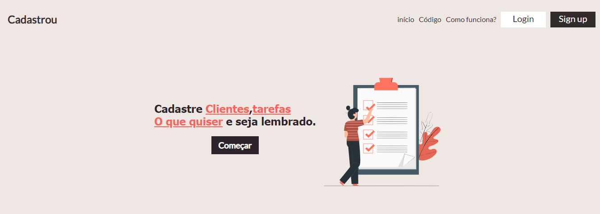
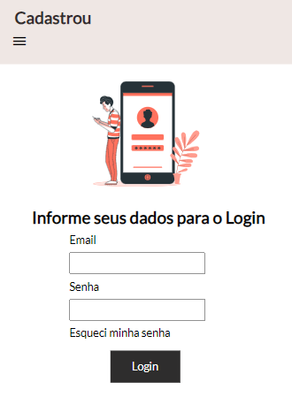
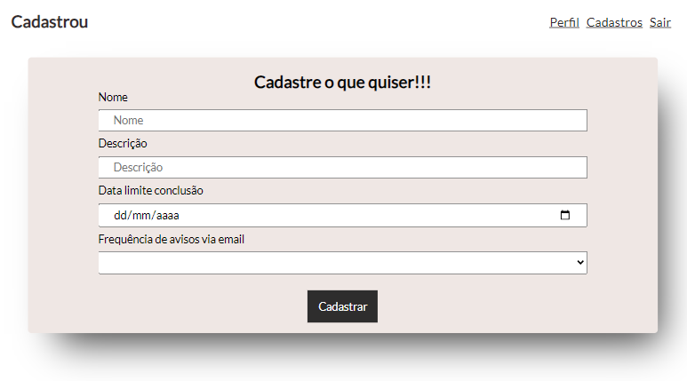
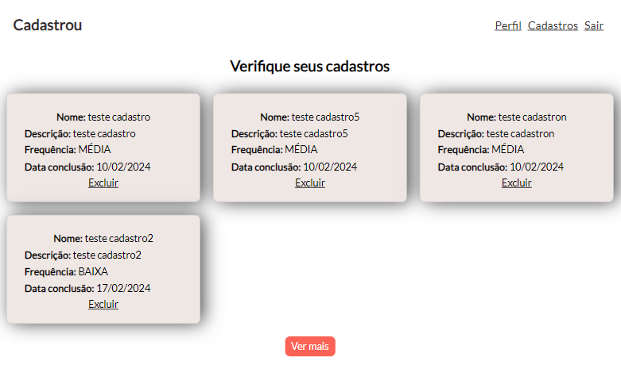

## Front-End cujo objetivo é consumir uma api feita em Spring boot. **[Link back-end](https://github.com/MarcosViniSil/Cadastrou-BackEnd)**

## Tecnologias utilizadas
- Angular
- TypeScript
- Vercel
- Gimp

## Contextualização
### A aplicação possibilita que o usuário se registre, realize login e também é possível cadastrar cards, que podem ter qualquer contexto, possibilitando cadastrar o que quiser. Existe também uma área de perfil, onde é possível visualizar dados, alterar senha e solicitar exclusão de conta. 

## Imagens da aplicação

  

  

  

  

